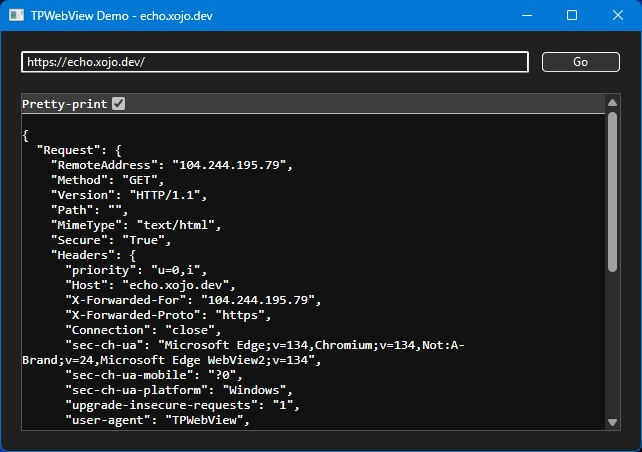

# TPWebView

A DesktopContainer that behaves like HTMLViewer and uses the a XAML WebView2 on Windows to render CSS better.

Key Features:

- Dynamically embeds `DesktopHTMLViewer` so Windows does not include libcef
- Uses WebView2 on Windows for more modern CSS rendering
- Adds optional border with support for light mode, dark mode, and high contrast
